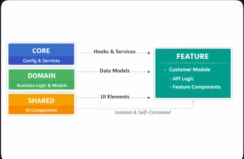

# 📂 Estrutura do Projeto

## Indíce

    1. core
    2. domain
    3. feature
    4. shared
    5. conclusão

`Nota`: "Estruturar seu código corretamente não é tão fácil quando o chão está se movendo sob seus
pés",
[Clean Architecture in React](https://alexkondov.com/full-stack-tao-clean-architecture-react/).

Quando estava lendo sobre estrutura de projeto me deparei com esse comentàrio do autor **Alex
Kondov**, para o meu desespero, realmente é complexo entender que para separa um arquivo entre
pasta, sua natureza deve ser compreendida, por mais simples que seja a minha aplicação isso me levou
a criar novos arquivos. Um agradecimento aos devs que vieram antes de mim.

### Como está organizada a estruturada do projeto:

```
.
├── app
│   └── App.jsx
├── core
│   ├── config
│   │   └── routes
│   │       └── Routes.jsx
│   ├── context
│   │   ├── auth
│   │   │   ├── authServices.js
│   │   │   └── authSlice.js
│   │   └── error
│   │       ├── error-boundary
│   │       │   ├── error-boundary.css
│   │       │   └── ErrorBoundary.jsx
│   │       ├── errorContext.js
│   │       └── ErrorProvider.jsx
│   ├── errors
│   │   └── mapErrorMessage.js
│   ├── http
│   │   └── axiosInstance.js
│   ├── logger
│   │   └── logger.js
│   ├── middlewares
│   │   └── axiosInterceptor.js
│   ├── store
│   │   └── store.js
│   └── utils
├── domain
│   ├── models
│   │   ├── addressModel.js
│   │   ├── companyModel.js
│   │   ├── customersModel.js
│   │   ├── productModel.js
│   │   └── supplierModel.js
│   ├── schemas
│   │   └── index.js
│   └── services
│       └── addressApi
│           └── AddressApi.js
├── features
│   ├── company
│   │   ├── api
│   │   │   ├── createCompany.js
│   │   │   ├── profileCompany.js
│   │   │   └── __queryOptions.js
│   │   └── hooks
│   ├── customers
│   │   ├── api
│   │   │   ├── createCustomer.js
│   │   │   └── listCustomers.js
│   │   ├── components
│   │   │   └── ListCustomers.jsx
│   │   └── hooks
│   │       └── useCustomer.js
│   ├── products
│   │   ├── api
│   │   │   ├── createProduct.js
│   │   │   └── listProducts.js
│   │   └── hooks
│   │       └── useProducts.js
│   └── suppliers
├── index.css
├── main.jsx
├── pages
│   ├── home
│   │   ├── Home.jsx
│   │   └── home-style.css
│   ├── login
│   │   ├── Login.jsx
│   │   └── login-style.css
│   └── register
│       ├── Register.jsx
│       └── register-style.css
└── shared
    ├── assets
    │   └── bg-login.png
    ├── components
    │   ├── atoms
    │   │   ├── button
    │   │   │   ├── button.css
    │   │   │   └── Button.jsx
    │   │   ├── errors
    │   │   │   └── ErrorMessage.jsx
    │   │   ├── inputs
    │   │   │   ├── input.css
    │   │   │   ├── Input.jsx
    │   │   │   └── inputMask.jsx
    │   │   └── select
    │   │       └── Select.jsx
    │   ├── molecules
    │   │   ├── cards
    │   │   │   ├── card.css
    │   │   │   └── Card.jsx
    │   │   ├── customerForm
    │   │   │   ├── customer-form.css
    │   │   │   └── CustomerForm.jsx
    │   │   ├── form
    │   │   │   ├── form.css
    │   │   │   └── Form.jsx
    │   │   ├── listComponent
    │   │   │   ├── list-group.css
    │   │   │   └── ListGroup.jsx
    │   │   ├── productForm
    │   │   │   ├── product-form.css
    │   │   │   └── ProductForm.jsx
    │   │   ├── stepsRegister
    │   │   │   ├── Step1.jsx
    │   │   │   ├── Step2.jsx
    │   │   │   ├── Step3.jsx
    │   │   │   └── steps.css
    │   │   └── supplierForm
    │   │       ├── supplier-form.css
    │   │       └── SupplierForm.jsx
    │   ├── organisms
    │   │   ├── container
    │   │   │   ├── container.css
    │   │   │   └── Container.jsx
    │   │   ├── dashboard
    │   │   │   ├── dashboard.css
    │   │   │   └── Dashboard.jsx
    │   │   ├── footer
    │   │   │   ├── footer.css
    │   │   │   └── Footer.jsx
    │   │   ├── header
    │   │   │   ├── header.css
    │   │   │   └── Header.jsx
    │   │   ├── loading
    │   │   │   ├── loading-class.css
    │   │   │   └── LoadingComponent.jsx
    │   │   ├── sidebar
    │   │   │   ├── sidebar.css
    │   │   │   └── Sidebar.jsx
    │   │   └── wave
    │   │       ├── WaveComponent.jsx
    │   │       └── wave.css
    │   └── templates
    │       ├── home-layout.css
    │       ├── HomeLayout.jsx
    │       ├── loginLayout
    │       │   ├── login-layout.css
    │       │   └── LoginLayout.jsx
    │       └── registerlayout
    │           ├── register-layout.css
    │           └── RegisterLayout.jsx
    └── hooks
        ├── useAuth.js
        ├── useHeader.js
        └── useMultiStep.js

```

### 1. **[Core](../src/core/)** :

- Configuração central, context, roteamento, store, http client, middleware.

```
├── core
│   ├── config
│   ├── context
│   ├── errors
│   ├── http
│   ├── logger
│   ├── middlewares
│   ├── store
│   └── utils

```

### 2. **[Domain](../src/domain/)** :

- O coração do software. Contém as regras de negócio puras, modelos de dados e schemas, sem
  dependência de bibliotecas externas.

```
├── domain
│   ├── models
│   ├── schemas
│   └── services

```

### 3. **[Feature](../src/features/)** :

- Na pasta Features mantive as funcionalidades de cada grupo customers, products, companies e
  suppliers separadas, e cada grupo possui suas proprias sub-pasta com componentes e logíca,
  isoladas. Isso garante a escabilidade, teste unitários e legibilidade do código na aplicação.

```
features
│   ├── company
│   │   ├── api
│   │   └── assets
│   │   └── components
│   │   └── hooks

```

#### 4. **[Shared](../src/shared/)** :

- Componentes reutilizáveis (atoms, molecules, organisms).

```
shared
    ├── assets
    ├── components
    │   ├── atoms
    │   │   ├── button
    │   │   ├── errors
    │   │   ├── inputs
    │   │   └── select
    │   ├── molecules
    │   │   ├── cards
    │   │   ├── form
    │   │   ├── stepsRegister
    │   ├── organisms
    │   │   ├── container
    │   │   ├── dashboard
    │   │   ├── footer
    │   │   ├── header
    │   │   ├── loading
    │   │   ├── sidebar
    │   │   └── wave
    │   └── templates
    └── hooks
```

### 5. Conclusão

A adoção do Domain-Driven Design (DDD) combinado com a Clean Architecture neste projeto não foi
apenas um exercício de organização de arquivos, mas uma decisão estratégica para garantir a saúde do
software a longo prazo.

Embora o processo de entender a natureza de cada arquivo e "mover o chão sob os pés" tenha
adicionado uma camada inicial de complexidade e boilerplate, os benefícios colhidos justificam o
esforço:

- **Isolamento de Negócio:** Mudanças em APIs externas, bibliotecas de validação (como Zod) ou no
  próprio framework (React) impactam apenas as camadas periféricas (`core`, `shared` ou
  `infrastructure`), mantendo o `domain` intacto.

- **Escalabilidade por Contextos:** O crescimento da aplicação ocorre de forma previsível dentro da
  pasta `features`. Novos módulos (ex: vendas, relatórios) podem ser plugados sem interferir nos
  existentes.

- **Manutenibilidade Simplificada:** A separação visual baseada em Atomic Design dentro de `shared`
  e a centralização de regras em `core` reduzem drasticamente o tempo gasto procurando onde corrigir
  um bug ou implementar uma melhoria.

  .

Esta arquitetura transforma o React no que ele realmente deve ser: uma biblioteca de entrega de
interface (UI), enquanto as regras que ditam o valor do software permanecem seguras, testáveis e
independentes. O design de software é um processo vivo, e esta estrutura pavimenta o caminho para
que o projeto evolua com segurança, sem medo das mudanças tecnológicas do futuro.
